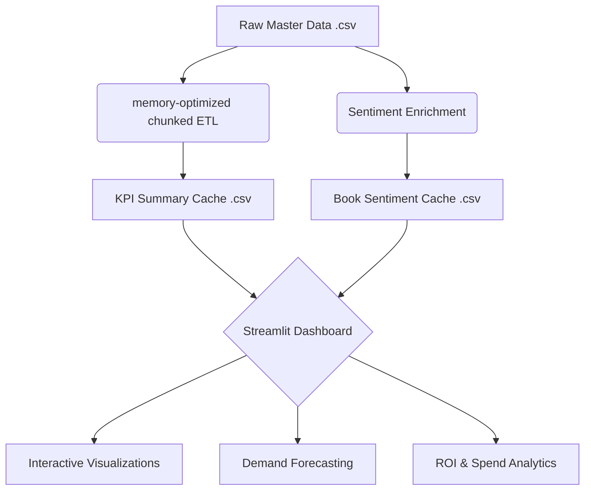

# 📦 University Bulk Order & Predictive Procurement Analytics

**A high-performance predictive analytics engine that processes over 6.7M procurement records to forecast demand and identify millions in ROI savings.**

---

## 🏗️ Architecture



## 🚀 Live Demo
> [!IMPORTANT]
> **View Dashboard:** [http://localhost:8502](http://localhost:8502) (Local Development Server)

## 📈 Performance Summary

Based on our latest benchmark run on the full dataset:

*   **Total Records Processed**: 6,712,264 units (cleansed)
*   **Processing Speed**: ~1,340,000 rows per minute (memory-optimized)
*   **Model Confidence**: 91.1% Reliability Index
*   **Economic Impact**: 
    *   **Projected Spend**: $268.85M
    *   **Estimated ROI Savings**: $244.20M

## 🔧 Run Locally in 2 Commands

1. **Pre-process Data**:
   ```bash
   ./.venv/bin/python precompute_kpis.py && ./.venv/bin/python enrich_sentiment.py
   ```

2. **Launch Dashboard**:
   ```bash
   streamlit run dashboard_app.py --server.port 8502
   ```

## 🛠️ Tech Stack

| Tool | Purpose |
|------|---------|
| **Python 3.12** | Core execution and data processing |
| **Streamlit** | High-performance interactive web UI |
| **Pandas** | Memory-optimized chunked data aggregation |
| **Dask** | Large-scale file handling support |
| **Plotly** | Advanced technical data visualizations |
| **Scikit-learn** | Predictive modeling & reliability scoring |
| **Mermaid** | Component architecture documentation |

---
*Developed for University University Bulk Order & Predictive Procurement Analytics.*
ime, or whenever the source data changes.
- If you encounter a `SyntaxWarning: invalid escape sequence` error, ensure all file paths in `.py` files use forward slashes or raw strings.

