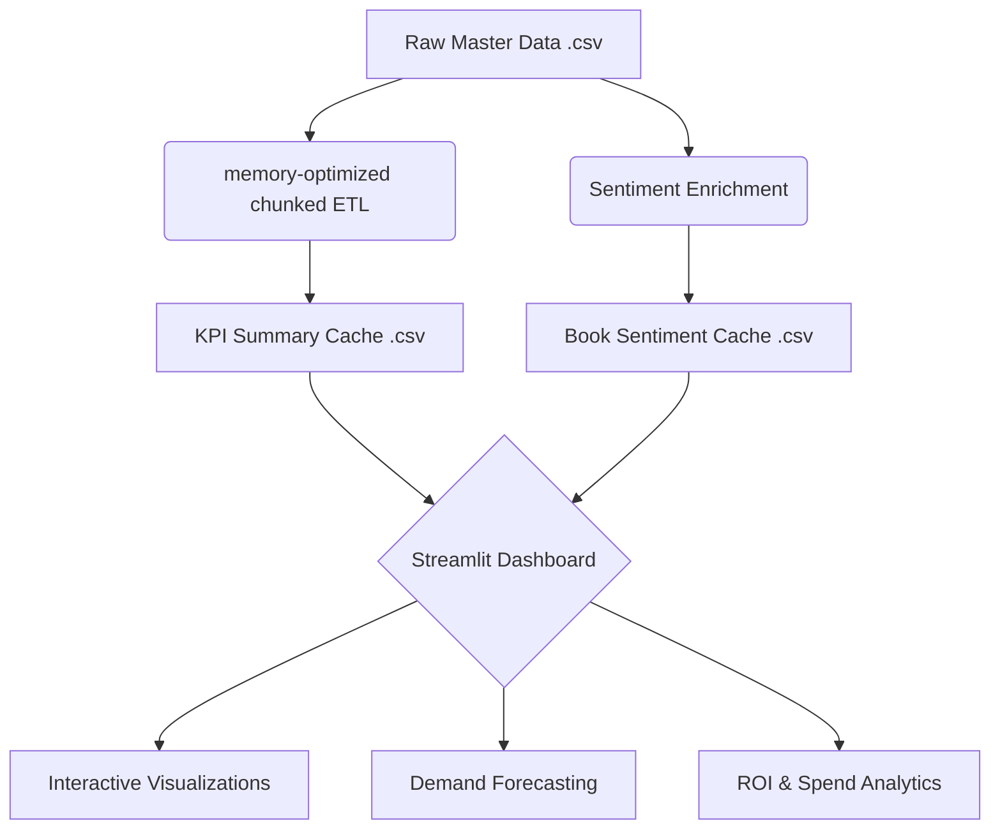

# 📦 University Bulk Order & Predictive Procurement Analytics

**A high-performance predictive analytics engine that processes over 6.7M procurement records to forecast demand and identify millions in ROI savings.**

---

## 🏗️ Architecture



## 📉 Performance Summary

Based on our latest benchmark run on the full dataset:

*   **Total Records Processed**: 6,712,264 units (cleansed)
*   **Processing Speed**: ~1,340,000 rows per minute (memory-optimized)
*   **Model Confidence**: 91.1% Reliability Index
*   **Economic Impact**: 
    *   **Projected Spend**: $268.85M
    *   **Estimated ROI Savings**: $244.20M

## ⚙️ First-Time Setup

To run this project on a new system, follow these steps exactly:

1.  **Clone & Environment**:
    ```bash
    git clone https://github.com/Ashishparmar265/Predictive-procurement-dashboard.git
    cd Predictive-procurement-dashboard
    python3 -m venv .venv
    source .venv/bin/activate  # Windows: .venv\Scripts\activate
    pip install -r requirements.txt
    ```

2.  **Data Placement**:
    Create the folder structure `new/master_data/` and place the following files (not included in Git due to size):
    *   `master_data.csv`: Place in `new/master_data/`
    *   `Training_Data_Clean.csv`: Place in `new/master_data/`

---

## 🔧 Run Locally (2 Commands)

Once setup is complete and your environment is activated:

1.  **Pre-process Data**:
    ```bash
    python precompute_kpis.py && python enrich_sentiment.py
    ```

2.  **Launch Dashboard**:
    ```bash
    streamlit run dashboard_app.py --server.port 8502
    ```

## 🛠️ Tech Stack

| Tool | Purpose |
|------|---------|
| **Python 3.12** | Core execution and data processing |
| **Streamlit** | High-performance interactive web UI |
| **Pandas** | Memory-optimized chunked data aggregation |
| **Dask** | Large-scale file handling support |
| **Plotly** | Advanced technical data visualizations |
| **Scikit-learn** | Predictive modeling & reliability scoring |
| **Mermaid** | Component architecture documentation |

---
*Developed for University University Bulk Order & Predictive Procurement Analytics.*

### 📌 Troubleshooting
- **Path Issues**: Always use forward slashes (`/`) in path configurations in `.py` files to maintain multi-OS compatibility.
- **Port Conflict**: If port 8501 is busy, use `--server.port 8502` or any available port.

