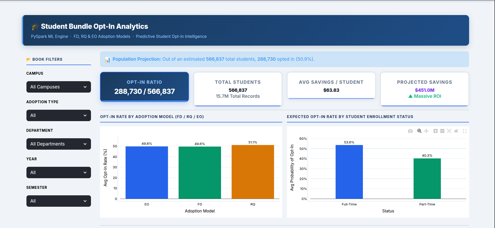
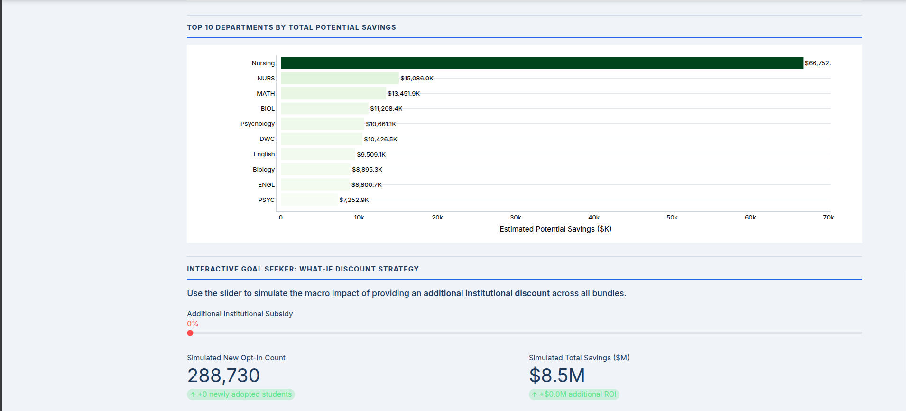
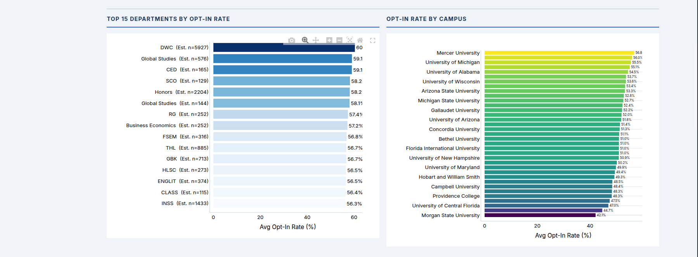
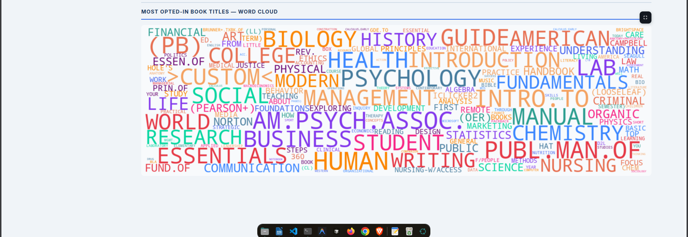
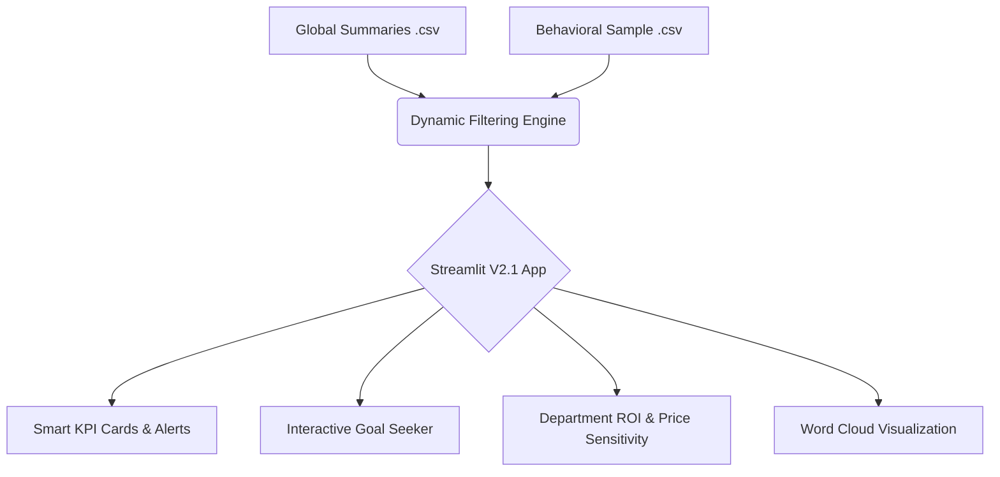

# 📦 University Predictive Procurement & Student Analytics Dashboard (V2.1)

**A high-performance, interactive predictive analytics engine that projects behavioral trends across 15.7M enrollment records to forecast demand, run economic simulations, and identify massive ROI savings for university systems.**



---

## 🚀 Interactive Dashboard Features (V2.1)

The latest version transforms static reporting into a "SaaS-grade" interactive decision-support interface for procurement stakeholders:

*   **Interactive Goal Seeker (What-If Analysis)**: A dynamic simulation engine that allows stakeholders to adjust "Additional Institutional Subsidies" via a slider, instantly recalculating expected student opt-in rates and projecting total new ROI savings.
    <br>
*   **Smart KPI Architecture**: 
    <br>
    *   **Context-Aware Comparisons**: Automatically compares performance against a 52.5% global benchmark, but intelligently hides redundant data when viewing the global dataset.
    *   **Dynamic Status Alerts**: KPI borders provide instant visual feedback, shifting between success (Green) and alert (Red) states based on performance metrics.
*   **Population Projections**: Extrapolates behavioral patterns from a high-fidelity sample to a global population of **~566,000 unique students**.
*   **Procurement Prioritization**: Interactive charts identify the Top 15 Departments with the highest potential for negotiation ROI.
    <br>
*   **Format & Model Analysis**: Compares adoption rates across structural models (First Day vs. Required vs. Explore Only) and formats (eBook vs. Physical).
*   **High-Demand Word Cloud**: A frequency-weighted, visual map of the most frequently adopted and opted-in course material titles.

---

## 🏗️ Architecture Pipeline



## 📉 Impact Summary

Based on the full population data model:

*   **Total Enrollments Processed**: 15,739,385 records
*   **Total Students Impacted**: ~566,830 (Estimated using empirical ratio)
*   **Prediction Model Validation**: Validated via rigorous AUC-ROC scoring on underlying dataset.
*   **Economic Strategy**: Empowers universities to optimize bulk purchasing and maximize student savings through data-backed negotiations.

---

## ⚙️ Quick Start

### 1. Setup Environment
```bash
git clone https://github.com/Ashishparmar265/Predictive-procurement-dashboard.git
cd Predictive-procurement-dashboard
python3 -m venv .venv
source .venv/bin/activate  # Windows: .venv\Scripts\activate
pip install -r requirements.txt
```

### 2. Launch Dashboard
The dashboard uses optimized datasets in the `resource/` directory for instant load times. No raw ETL is required.
```bash
streamlit run dashboard_app.py --server.port 8502
```

---

## 🛠️ Tech Stack

| Component | Technology | Purpose |
| :--- | :--- | :--- |
| **Core** | Python 3.12 | Fast execution and logic routing |
| **Frontend** | Streamlit | Highly interactive, state-driven web UI |
| **Data Engine** | Pandas | In-memory manipulation and filtering |
| **Visualization** | Plotly | Interactive, responsive charting |
| **Styling** | Custom CSS | Clean, modern layout with dynamic alerts |
| **Text Analytics**| WordCloud | Keyword extraction and visualization |

---
*Built to bring intelligent forecasting and modern UX to higher education procurement.*
