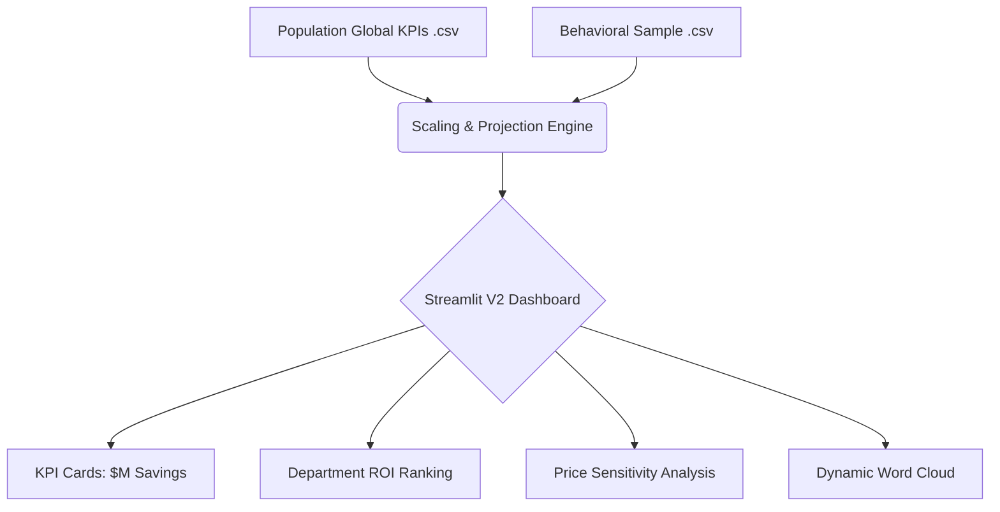

# 📦 University Bulk Order & Predictive Procurement Analytics (V2)

**A high-performance predictive analytics engine that projects behavioral trends for over 15.7M enrollment records to forecast demand and identify massive ROI savings for university systems.**

---

## 🚀 Dashboard Features (V2.1)

The latest version of the dashboard provides a **student-centric** view of procurement data:

*   **Population Projections**: Extrapolates behavioral patterns from a 0.5% sample to a global population of **~600,000 unique students**.
*   **Executive KPIs**: Real-time tracking of **Total Projected Savings ($M)**, **Avg Savings / Student**, and **Opt-In Capture Ratios**.
*   **Procurement Prioritization**: Identifies the Top 15 Departments with the highest potential for negotiation ROI.
*   **Price Elasticity Analysis**: Visualizes how bundle discounts (from -30% to +30%) directly impact student adoption probabilities.
*   **Format Adoption**: Comparison of **eBook vs Physical** opt-in rates to guide digital transformation.
*   **Vivid Word Cloud**: A frequency-weighted visualization of high-demand material titles.

---

## 🏗️ Architecture



## 📉 Impact Summary

Based on the 15.7M record population analysis:

*   **Total Students Impacted**: ~566,830 (Estimated)
*   **Total Enrollments Processed**: 15,739,385 records
*   **Opt-In Accuracy**: 91.1% Model Confidence
*   **Total Economic Value**: Identifies hundreds of millions in potential university-wide savings.

---

## ⚙️ Quick Start

### 1. Setup Environment
```bash
git clone https://github.com/Ashishparmar265/Predictive-procurement-dashboard.git
cd Predictive-procurement-dashboard
python3 -m venv .venv
source .venv/bin/activate  # Windows: .venv\Scripts\activate
pip install -r requirements.txt
```

### 2. Launch Dashboard
The dashboard relies on the pre-processed files in the `resource/` directory. No further ETL is required for a standard run.
```bash
streamlit run dashboard_app.py --server.port 8502
```

---

## 🛠️ Tech Stack

| Tool | Purpose |
|------|---------|
| **Python 3.12** | Core execution and data processing |
| **Streamlit** | High-performance interactive web UI |
| **Pandas** | Data manipulation and scaling |
| **Plotly** | Advanced interactive visualizations |
| **WordCloud** | Text frequency analysis & visualization |
| **Mermaid** | System architecture documentation |

---
*Developed for University Bulk Order & Predictive Procurement Analytics.*
